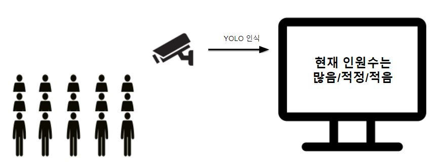
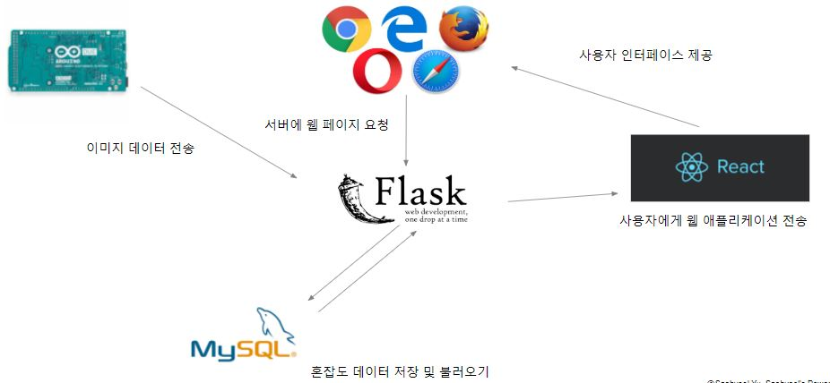

<<<<<<< HEAD
# Capstone-Design Project 

## 1. 프로젝트 주제

> object detection을 이용한 혼잡도 정보 제공 웹 서비스

- 시스템 동작과정 간략 소개
    1. 특정장소에 카메라를 설치해서 해당장소를 찍은 사진을 일정 시간 간격으로 서버에 보낸다.
    2. 서버에서는 사진으로부터 객체 검출을 통해 몇명의 사람이 있는지에 대한 정보를 추출한다.
    3. 해당 지역이 사람이 많아서 혼잡한지 또는 적은지에 대한 정보를 클라이언트에 보낸다.

 
 

## 2. 사용 기술 스택과 시스템 플로우

- 기술 스택 나열
    - 아두이노
    - 웹 서버 -> flask
    - 데이터베이스 -> mysql
    - 웹 프론트엔드 -> react.js
- 시스템 플로우
    - 아두이노에서는 캠으로 찍은 사진을 서버에 일정 시간 간격으로 보냄
    - 서버에서는 사진으로부터 사람 수를 측정해서 데이터베이스에 저장
    - 사용자는 웹서버로 웹페이지를 요청하면 서버에서는 웹 어플리케이션을 제공
    - 클라이언트에서 혼잡도 정보를 서버에 요청하면 서버에서는 데이터베이스로부터 혼잡도 데이터를 가져와서 클라이언트에 보냄

=======
# capstone-design
Object Detection(YoLo)을 활용한 혼잡 여부 확인 웹 서비스 (React/flask)
>>>>>>> 1a3d5e695f54245c153aaec351828b3a17a29ed5
